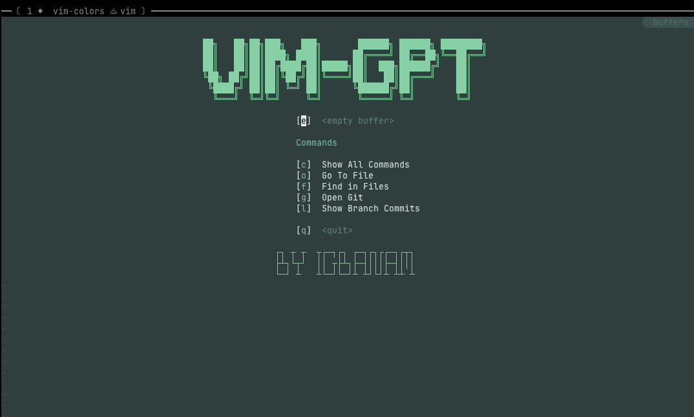

## Getting Started

### Quick Start

Install this with your favourite Vim plugin manager. I recommend [vim-plug][2]

To automatically download and activate Lantern Vim, follow the install instructions for [vim-plug][2] and

1. add `Plug 'igbanam/vim-colors'` to your `vimrc` within _vim-plug_'s plugin loading function
2. run the `:PlugInstall` command in Vim
3. activate the theme by adding `colorscheme [your-choice]` to the vimrc or change it on-the-fly by running `:colorscheme [your-choice]`

## Screenshots

### Green Lantern

  Copyright &copy; 2026-present <a href="https://igbanam.com" target="_blank">Igbanam</a>

[1]: https://github.com/itchyny/lightline.vim
[2]: https://github.com/junegunn/vim-plug
[4]: https://github.com/vim-airline/vim-airline

